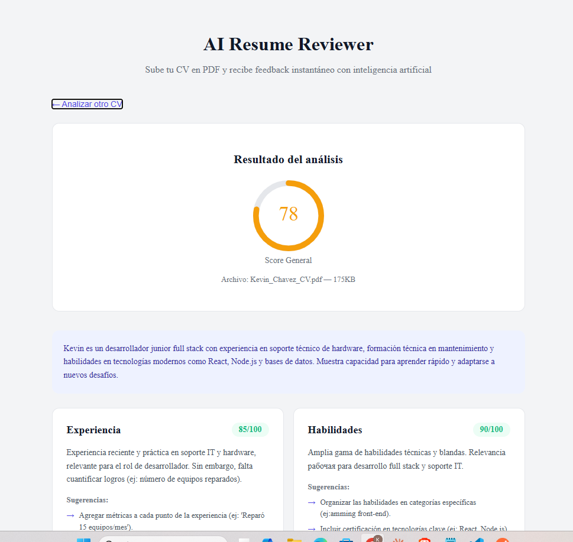

# AI Resume Reviewer

Analiza tu CV con inteligencia artificial. Sube un PDF y recibe feedback instantáneo con scores por sección, fortalezas y áreas de mejora.



## Demo

[ai-resume-reviewer-seven.vercel.app](https://ai-resume-reviewer-seven.vercel.app)

## Características

- Upload de CV en PDF con drag & drop
- Análisis con IA (LLM via OpenRouter)
- Score general y por sección (experiencia, habilidades, educación, redacción)
- Sugerencias accionables para mejorar el CV
- Fortalezas y áreas de mejora identificadas
- Diseño responsive

## Stack tecnológico

**Frontend:** React · Vite · Axios · react-dropzone · react-circular-progressbar
**Backend:** Node.js · Express · pdfjs-dist · OpenRouter API
**IA:** Modelo LLM gratuito via OpenRouter
**Deploy:** Vercel (frontend) · Render (backend)

## Instalación local

### Backend

```bash
git clone https://github.com/Kevin30042001/ai-resume-reviewer-api.git
cd ai-resume-reviewer-api
npm install
cp .env.example .env
# Agregar tu OPENROUTER_API_KEY en .env
npm run dev
```

### Frontend

```bash
git clone https://github.com/Kevin30042001/ai-resume-reviewer.git
cd ai-resume-reviewer
npm install
npm run dev
```

Abrir `http://localhost:5173`

## Autor

**Kevin** — [@Kevin30042001](https://github.com/Kevin30042001)
